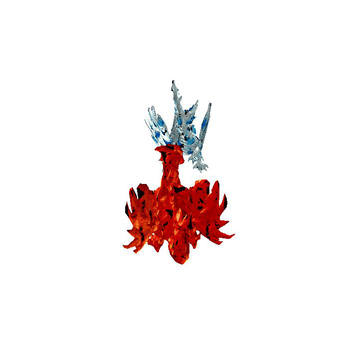

# <p align="center"> <font color=#008000>TeMO</font>: Towards <font color=#FF0000>Te</font>xt-Driven 3D Stylization for <font color=#008000>M</font>ulti-<font color=#008000>O</font>bject Meshes </p>

#####  <p align="center"> [Xuying Zhang](https://zhangxuying1004.github.io), [Bowen Yin](https://scholar.google.com/citations?hl=zh-CN&user=xr_FRrEAAAAJ), [Yuming Chen](https://scholar.google.com/citations?user=EweNbRAAAAAJ&hl=zh-CN), [Lin Zheng](https://scholar.google.com/citations?user=aCKl1R0AAAAJ&hl=zh-CN), [Yuheng Li](), [Qibin Hou](https://scholar.google.com/citations?user=fF8OFV8AAAAJ&hl=zh-CN), [Ming-Ming Cheng](https://scholar.google.com/citations?user=huWpVyEAAAAJ&hl=zh-CN)</p>

#### <p align="center"> [Paper Link](https://arxiv.org/pdf/2312.04248.pdf), accepted by <font color=#dd0000>CVPR 2024</font></p>


<table class="gif_table">
  <tbody>
    <tr>
     <td class="gif_td1"></td>
     <td class="gif_td2"></td>
     <td class="gif_td3"></td>
     <td class="gif_td4"></td>
   </tr>
    <tr>
     <td class="gif_td1"></td>
     <td class="gif_td2"></td>
     <td class="gif_td3"></td>
     <td class="gif_td4"></td>
   </tr>
  </tbody>
</table>


## 📖 Citation

If our work gives some inspiration to your research, please star this project and cite us. Thank you!

```
@article{zhang2023temo,
  title={TeMO: Towards Text-Driven 3D Stylization for Multi-Object Meshes},
  author={Zhang, Xuying and Yin, Bo-Wen and Chen, Yuming and Lin, Zheng and Li, Yunheng and Hou, Qibin and Cheng, Ming-Ming},
  journal={arXiv preprint arXiv:2312.04248},
  year={2023}
}
```
